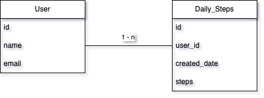
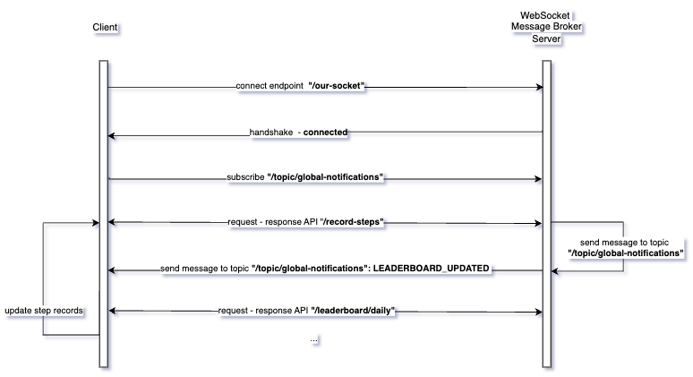

# MOMO Daily Steps
Ứng dụng Đi bộ - xếp hạng

- **4 API chính**:
  1. API ghi nhận số bước chân trong ngày hiện tại từ phía ứng dụng
  2. API lấy bảng xếp hạng để hiển thị ở ứng dụng
  3. API lấy tổng số bước chân của người dùng theo tuần hiện tại để hiển thị ở ứng dụng
  4. API lấy tổng số bước chân của người dùng theo tháng hiện tại để hiển thị ở ứng dụng

- **Thiết kế database:**

- **Luồng chính:**
